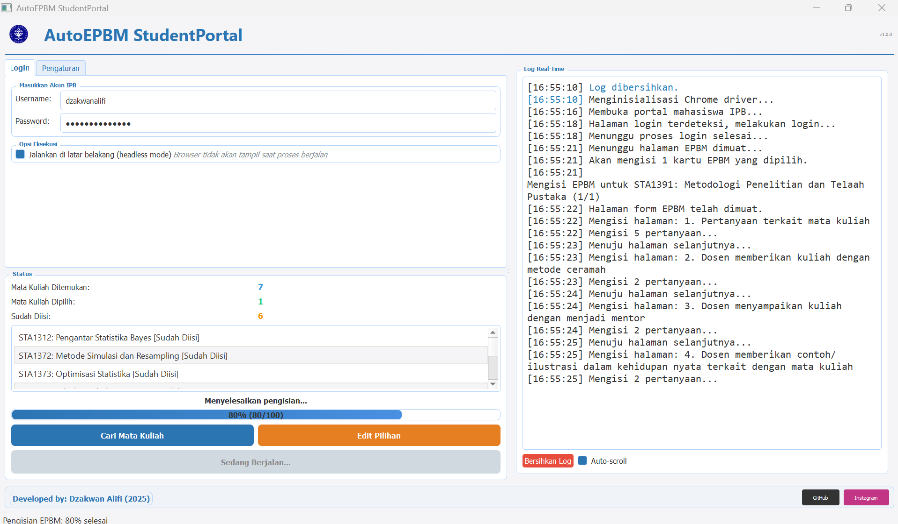

# 📊 AutoEPBM StudentPortal IPB

## 🌟 Pengenalan

AutoEPBM adalah aplikasi otomatis untuk mengisi form EPBM (Evaluasi Perkuliahan oleh Mahasiswa) di StudentPortal IPB University dengan cepat dan mudah. Bosan mengisi puluhan form EPBM satu per satu? AutoEPBM hadir untuk menyelamatkanmu! 

Dengan AutoEPBM, kamu bisa mengisi semua form EPBM hanya dalam hitungan detik, daripada menghabiskan bermenit-menit mengisi form secara manual.

## ✨ Fitur

- 🚀 **Otomatis Mengisi Semua Form EPBM** - Isi semua form dengan beberapa klik saja
- 🔍 **Pencarian Mata Kuliah** - Temukan semua mata kuliah yang perlu diisi
- ⚙️ **Kustomisasi Nilai** - Sesuaikan nilai yang ingin kamu berikan untuk setiap kategori
- 📝 **Saran Tersesuaikan** - Berikan saran personal untuk dosen
- 🎨 **Antarmuka Pengguna yang Bersih** - Mudah digunakan dan eye-catching
- 🔒 **Keamanan** - Kredensial login kamu tidak pernah disimpan
- 💬 **Logging Real-time** - Pantau proses pengisian secara langsung

## 📥 Download

Kamu bisa mengunduh versi terbaru AutoEPBM dari [halaman release GitHub](https://github.com/dzakwanalifi/AutoEPBM-App/releases/latest).

Atau klik langsung link di bawah untuk download versi terbaru:
- [AutoEPBM v1.0.0 (Windows)](https://github.com/dzakwanalifi/AutoEPBM-App/releases/download/v1.0.0/AutoEPBM.exe)

## 🛠️ Cara Penggunaan

### Langkah 1: Login

1. Buka aplikasi AutoEPBM
2. Masukkan username dan password IPB-mu
3. Secara default, aplikasi akan berjalan di latar belakang (headless mode). Uncheck opsi ini jika kamu ingin melihat browser bekerja.

### Langkah 2: Cari Mata Kuliah

1. Klik tombol "Cari Mata Kuliah"
2. Tunggu sampai proses scanning selesai
3. Aplikasi akan menampilkan semua mata kuliah yang perlu diisi EPBM-nya

### Langkah 3: Pilih Mata Kuliah

1. Secara default, semua mata kuliah yang belum diisi akan dipilih
2. Kamu bisa memilih matkul spesifik yang ingin diisi
3. **Catatan Penting**: Jika ada mata kuliah yang tidak memiliki dosen pengajar atau tidak memerlukan penilaian, tidak perlu diisi (hapus centang pada mata kuliah tersebut)
4. Klik OK untuk melanjutkan

### Langkah 4: Atur Nilai (Opsional)

1. Klik tab "Pengaturan" jika kamu ingin mengubah nilai default
2. Kamu bisa mengubah nilai untuk setiap kategori (1-4)
3. Atau gunakan preset "Semua Nilai 4" atau "Semua Nilai 3" untuk pengisian cepat
4. Juga bisa mengubah saran untuk dosen sesuai keinginan

### Langkah 5: Mulai Otomasi

1. Klik tombol "Mulai Otomasi EPBM"
2. Pantau progres pengisian di panel log
3. Setelah selesai, kamu akan melihat pesan konfirmasi

## 💡 Tips & Trik

- **Mode Headless**: Untuk pengisian paling cepat, biarkan mode headless aktif (browser tidak terlihat)
- **Koneksi Internet**: Pastikan koneksi internetmu stabil untuk hasil terbaik
- **Preset**: Gunakan preset nilai untuk pengisian cepat dan konsisten
- **Banyak Matkul**: Jika kamu punya banyak matkul, proses akan memakan waktu lebih lama, jadi bersabarlah 😊
- **Mata Kuliah Tanpa Dosen**: Beberapa mata kuliah mungkin tidak memiliki dosen pengajar atau tidak memerlukan penilaian. Hindari memilih mata kuliah tersebut agar proses pengisian tidak terganggu.

## ❓ FAQ

### Apakah aplikasi ini aman?
Ya! AutoEPBM tidak menyimpan username dan password kamu. Semua informasi login hanya digunakan untuk sesi pengisian dan tidak pernah dikirim ke server manapun.

### Apakah nilai yang saya berikan akan benar-benar tersimpan?
Tentu saja! AutoEPBM melakukan hal yang sama seperti yang kamu lakukan secara manual, jadi semua nilai akan tersimpan dengan benar di sistem IPB.

### Aplikasinya tidak bisa dibuka, apa yang harus saya lakukan?
Pastikan kamu sudah menginstall Chrome di komputermu. AutoEPBM membutuhkan Chrome untuk bekerja.

### Kenapa prosesnya kadang lambat?
Kecepatan pengisian tergantung pada koneksi internet dan responsivitas server IPB. Pada jam sibuk, server IPB biasanya lebih lambat merespon.

### Mengapa beberapa mata kuliah error saat pengisian?
Beberapa mata kuliah mungkin tidak memiliki dosen pengajar atau memiliki format EPBM yang berbeda. Sebaiknya hapus centang pada mata kuliah tersebut saat memilih mata kuliah yang akan diisi.

## 🐛 Pelaporan Bug

Menemukan bug? Buat issue baru di [GitHub Issues](https://github.com/dzakwanalifi/AutoEPBM-App/issues) dengan detail sebanyak mungkin tentang masalah yang kamu temui.

## 🤝 Kontribusi

Kontribusi selalu diterima dengan senang hati! Jika kamu ingin berkontribusi:

1. Fork repositori ini
2. Buat branch fitur baru (`git checkout -b fitur-keren`)
3. Commit perubahanmu (`git commit -m 'Menambahkan fitur keren'`)
4. Push ke branch (`git push origin fitur-keren`)
5. Buat Pull Request baru

## 📄 Lisensi

Proyek ini dilisensikan di bawah lisensi MIT - lihat file [LICENSE](LICENSE) untuk detail.

## 👨‍💻 Tentang Pengembang

Dibuat dengan ❤️ oleh [Dzakwan Alifi](https://github.com/dzakwanalifi) (2025), mahasiswa Statistika dan Sains Data IPB University.

## 📸 Screenshot

---

### Catatan Penting

Aplikasi ini dibuat untuk tujuan pendidikan dan efisiensi. Tolong gunakan dengan bijak dan tetap berikan umpan balik yang jujur untuk dosen-dosenmu. AutoEPBM hanya membantu mengatasi masalah teknis pengisian form, tetapi kualitas pendidikan tetap bergantung pada umpan balik yang jujur dari kita semua.

Terima kasih telah menggunakan AutoEPBM! 👨‍🎓✨
