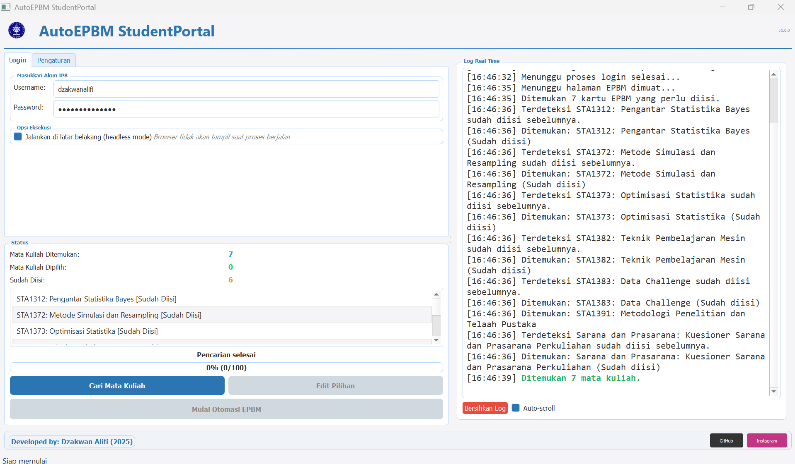
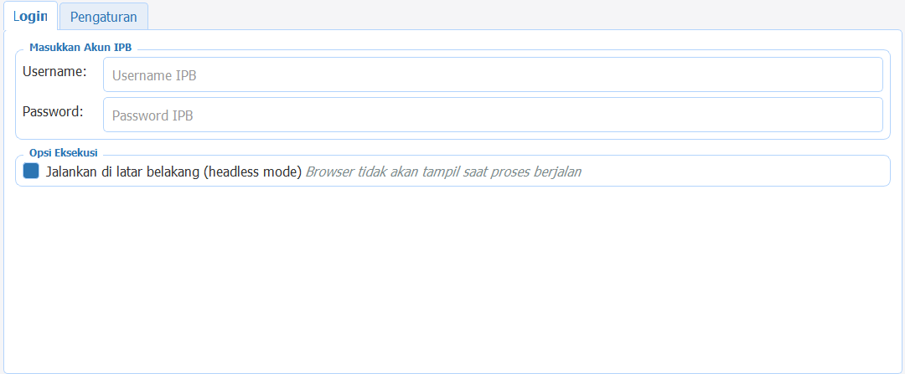
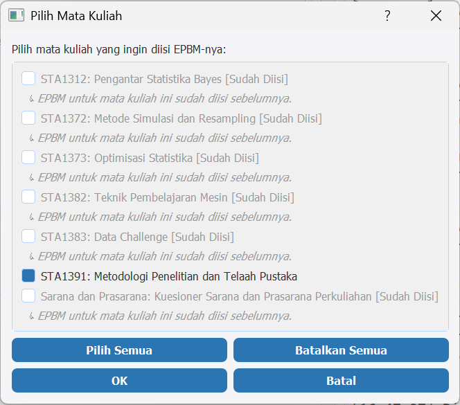
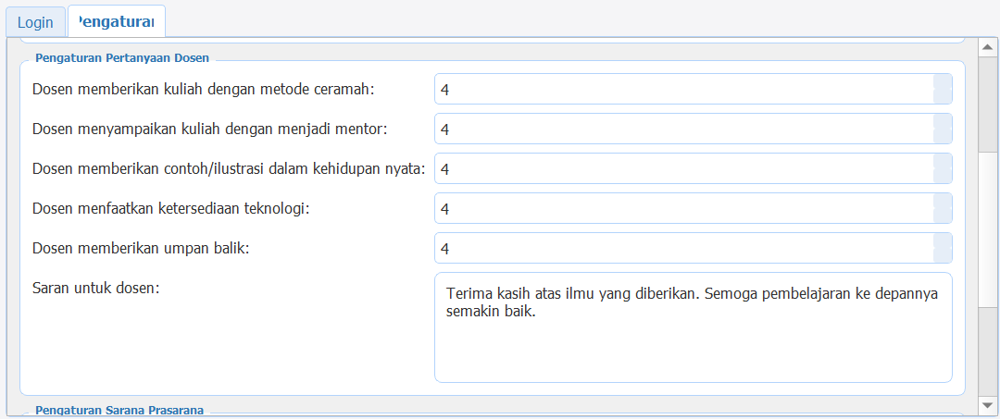

# 🚀 AutoEPBM - Student Portal IPB

  

**Isi form EPBM dengan cepat dan mudah! Dari manual ke otomatis dalam hitungan detik.**

[🔍 Fitur](#-fitur) • 
[⬇️ Download](#️-download) • 
[🛠️ Penggunaan](#️-cara-penggunaan) • 
[❓ FAQ](#-faq) • 
[👨‍💻 Pengembang](#-tentang-pengembang)

---

## 🌟 Pendahuluan

AutoEPBM mengotomatisasi pengisian formulir EPBM (Evaluasi Perkuliahan oleh Mahasiswa) di StudentPortal IPB University. Dengan sekali klik, kamu bisa mengisi semua form EPBM tanpa perlu menghabiskan waktu berharga untuk mengisi puluhan form secara manual.

> 💡 **Mengisi EPBM menjadi semudah klik sekali!**

## ✨ Fitur

| 🚀 **Otomasi Lengkap** | 🎯 **Kustomisasi** | 🔒 **Keamanan** |
|:-------------------------:|:-------------------------:|:-------------------------:|
| Isi semua form hanya dengan beberapa klik | Sesuaikan nilai evaluasi untuk setiap kategori | Kredensial tidak pernah disimpan |
|  |  |  |

- 🔍 **Smart Scanning** - Otomatis mendeteksi mata kuliah yang perlu diisi
- 📋 **Pemilihan Mata Kuliah** - Pilih mata kuliah tertentu yang ingin kamu isi
- ⚙️ **Preset Nilai** - Gunakan preset nilai atau sesuaikan untuk setiap kategori
- 📝 **Saran Kustom** - Berikan saran personal untuk dosen-dosenmu
- 🏃‍♂️ **Mode Headless** - Pengisian cepat tanpa menampilkan browser
- 🧪 **Mode Uji** - Coba tanpa menyimpan untuk memastikan semuanya bekerja
- 💬 **Logging Real-time** - Pantau kemajuan proses secara langsung
- 🎨 **Antarmuka Modern** - Desain yang intuitif dan menarik

## 📥 Download

### Windows

### Source Code

Persyaratan Sistem

- Windows 7/8/10/11 (64-bit)
- Google Chrome terinstal
- Koneksi internet stabil
- Min. 4GB RAM
- Min. 200MB ruang disk

## 🛠️ Cara Penggunaan

### 1️⃣ Login
- Buka aplikasi AutoEPBM
- Masukkan username dan password IPB-mu
- Opsional: nonaktifkan mode headless untuk melihat browser bekerja

  

### 2️⃣ Cari Mata Kuliah
- Klik tombol "Cari Mata Kuliah"
- Aplikasi akan memindai mata kuliah yang perlu diisi
- Pilih mata kuliah spesifik yang ingin diisi

  

  
<strong>⚠️ Tip Penting:</strong> Jangan pilih mata kuliah tanpa dosen atau yang tidak memerlukan penilaian

### 3️⃣ Atur Nilai (Opsional)
- Buka tab "Pengaturan" untuk menyesuaikan penilaian
- Sesuaikan nilai (1-4) untuk setiap kategori penilaian
- Kostumisasi saran untuk dosen

  

### 4️⃣ Mulai Otomasi
- Klik "Mulai Otomasi EPBM"
- Pantau kemajuan di panel log
- Tunggu sampai proses selesai

## 💡 Tips & Trik

| Tip | Deskripsi |
|:---:|:---|
| ⚡ | Gunakan mode headless untuk pengisian tercepat |
| 🔄 | Gunakan preset nilai untuk konsistensi |
| 🧪 | Coba mode uji terlebih dahulu untuk verifikasi |
| ❌ | Hindari memilih mata kuliah tanpa dosen pengajar |
| 🕒 | Jalankan di luar jam sibuk untuk respons server lebih cepat |

## ❓ FAQ

<b>Apakah aplikasi ini aman?</b>

Ya! AutoEPBM tidak menyimpan atau mengirim kredensial login ke server manapun. Semua proses berjalan di komputer lokalmu.

<b>Apakah nilai yang saya berikan benar-benar tersimpan?</b>

Tentu saja! AutoEPBM melakukan hal yang sama seperti ketika kamu mengisi secara manual, sehingga semua penilaian tersimpan dengan benar di sistem IPB.

<b>Aplikasi tidak bisa dibuka, apa yang harus dilakukan?</b>

Pastikan Google Chrome terinstal di komputermu. Jika sudah terinstal, coba nonaktifkan antivirus sementara dan jalankan sebagai administrator.

<b>Mengapa beberapa mata kuliah error saat pengisian?</b>

Beberapa mata kuliah mungkin memiliki struktur yang berbeda atau tidak memerlukan pengisian EPBM. Sebaiknya batalkan pilihan pada mata kuliah tersebut.

## 🐛 Pelaporan Bug

Jika menemukan bug, tolong sertakan:
- Screenshot error
- Langkah-langkah yang kamu lakukan
- Versi aplikasi yang digunakan
- OS yang digunakan

## 🤝 Kontribusi

Kontribusi selalu diterima dengan senang hati! Langkah kontribusi:

1. Fork repositori
2. Buat branch fitur (`git checkout -b fitur-keren`)
3. Commit perubahan (`git commit -m 'Menambahkan fitur keren'`)
4. Push ke branch (`git push origin fitur-keren`)
5. Buat Pull Request

## 📄 Lisensi

Proyek ini dilisensikan di bawah MIT License - lihat file [LICENSE](LICENSE) untuk detail.

## 👨‍💻 Tentang Pengembang

  <h3>Dzakwan Alifi</h3>
  
Mahasiswa Statistika dan Sains Data, IPB University (2025)

  
  
  
  

---

  

    <strong>AutoEPBM v1.0.0</strong> • Dibuat dengan ❤️
  

  
  © 2025 Dzakwan Alifi • Semua merek dagang dan logo adalah milik dari pemiliknya masing-masing.
  
   
  
  
  

---

### 📌 Catatan Penting

Aplikasi ini dibuat untuk tujuan pendidikan dan efisiensi. Harap gunakan dengan bijak dan tetap berikan umpan balik yang jujur untuk dosen-dosenmu. AutoEPBM hanya mempermudah proses pengisian, tetapi kualitas pendidikan tetap bergantung pada umpan balik yang konstruktif dari mahasiswa.

